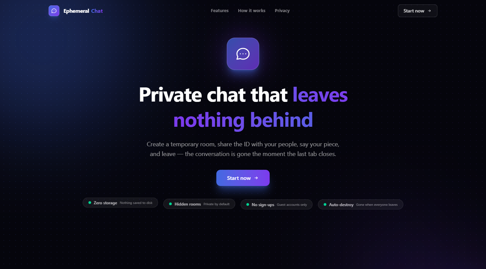
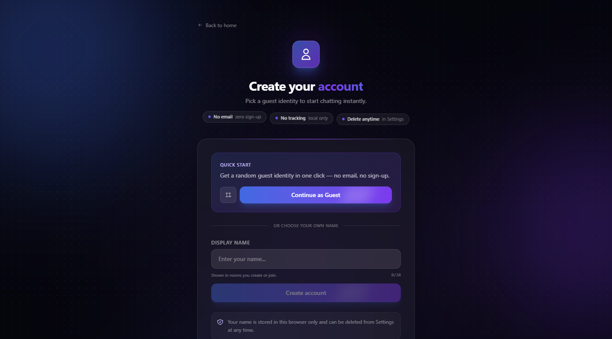
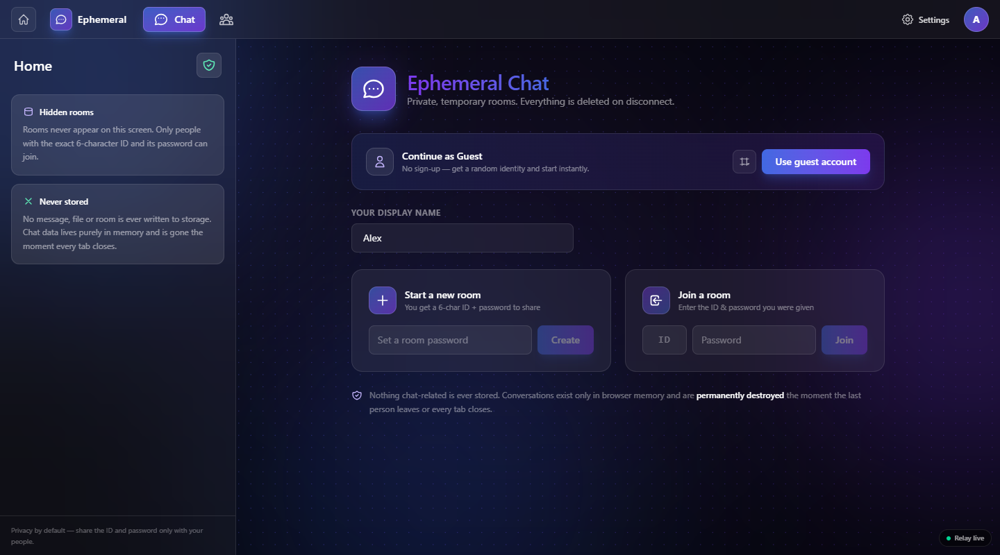
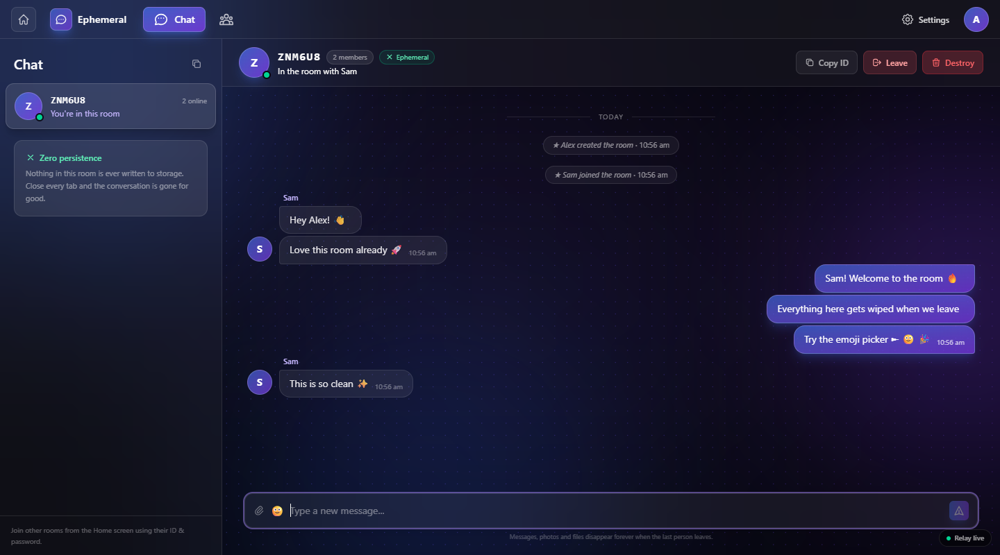
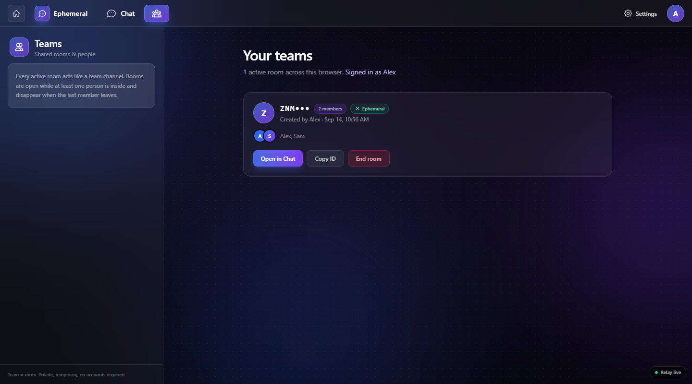
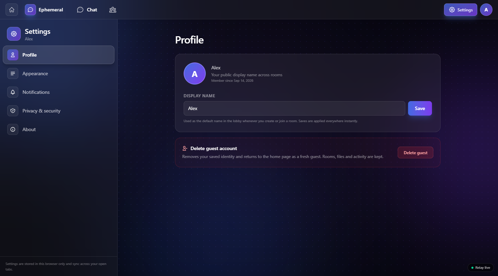
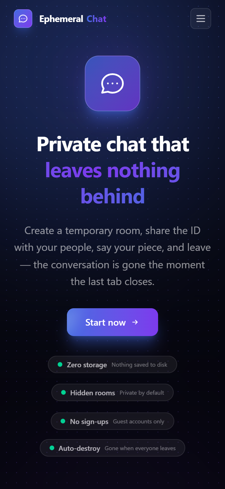
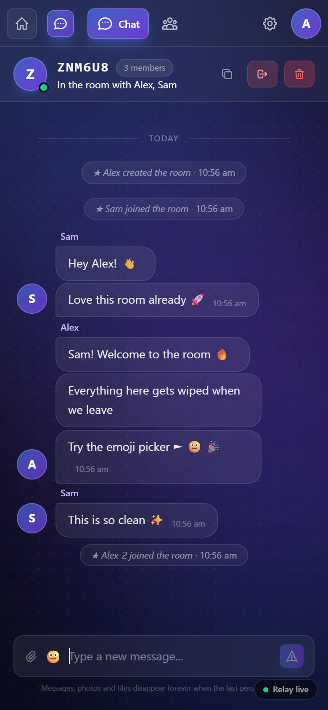

# 💬 Ephemeral Chat

A beautiful, zero-persistence chat app. Send messages, images and files through **RAM-only rooms** that self-destruct the moment everyone leaves.

Built with a **React 19 + Vite 8 + Tailwind CSS v4** client and a **Node.js + Express 5 + Socket.IO** relay server — with **no database anywhere**. Conversations are real-time, private, and gone forever when you close the last tab.

> 🔒 **Zero persistence by design.** No database, no disk writes, no chat data in `localStorage`. The relay keeps everything in memory and forgets the room the second it empties.

---

## ✨ Features

### 🔐 Ephemeral rooms
- Rooms live **in server RAM only** and are streamed to every connected client in real time.
- 6-character room IDs (`9DDQLE`) that are **password-protected** — nobody can join without both.
- Rooms are **never listed publicly**; they are un-discoverable.
- Auto-destroy **~30 s after the last member leaves** (with a ~20 s reconnect grace for quick tab switches / network blips).
- Hard 24-hour maximum lifetime — a room cannot outlive a day even if still active.

### 💬 Real chat-app experience
- **Grouped bubbles** — consecutive messages from the same sender merge into one bubble with timestamps.
- **Day dividers** — "Today / Yesterday / date" markers keep long threads readable.
- **Typing indicator** — live *"Alice is typing…"* with pulsing dots.
- **Multiline composer** — auto-growing textarea, `Enter` to send, `Shift+Enter` for a new line.
- **Emoji picker** — 44-emoji grid with click-to-insert.
- **Delete for everyone** — senders can retract messages and files (replaced by a tombstone).
- **File & image sharing** — inline image preview, click-to-zoom, download button and file chips (max **800 KB**).
- **Audio feedback** — send chirp + incoming-message tone (toggleable in Settings).
- **Leave alerts + read receipts** — when someone closes the tab you instantly see *"Bob left the chat"*, and if they left messages unread it says so too.

### 🧑‍💻 Guest accounts — no sign-up
- One click to continue as a random guest (`Guest-XXXX`) or type your own display name.
- Names are sanitized and stored **locally only** (non-chat data).
- Duplicate names are auto-suffixed by the server (`Bob` → `Bob-2`) so you can join the same room from multiple tabs/devices.

### 🎨 Polished UI
- Dark aurora + animated dot-field background.
- Full landing page with feature cards, "how it works", privacy & security guide, and footer.
- Top navigation bar (Chat / Teams / Settings) and fully responsive layout down to mobile.
- Hardened production build: injected **CSP**, `noindex`/`nofollow` meta, no source maps.

---

## 📸 Screenshots

### Desktop

| Landing page | Guest sign-up |
| --- | --- |
|  |  |

| Room lobby (create / join) | Live chat |
| --- | --- |
|  |  |

| Teams (room directory) | Settings |
| --- | --- |
|  |  |

### Mobile

| Landing page | Live chat |
| --- | --- |
|  |  |

---

## 🛠 Tech Stack

| Layer | Choice |
| --- | --- |
| Frontend | [React 19](https://react.dev) |
| Build tool | [Vite 8](https://vite.dev) |
| Styling | [Tailwind CSS v4](https://tailwindcss.com) |
| Realtime | [Socket.IO](https://socket.io) `4.x` |
| Server | [Express 5](https://expressjs.com) on [Node.js](https://nodejs.org) |
| Linting | [Oxlint](https://oxc.rs/docs/guide/usage/lint.html) |
| Persistence | **None for chat** — RAM only. `localStorage` holds just non-chat settings / activity / name |

---

## 🏗 Architecture

Three pieces talk to each other entirely over Socket.IO:

```
┌────────────┐   Socket.IO   ┌─────────────────────────────┐
│  Browser   │ ─────────────>│  Relay server (Node/Express)│
│  (React)   │ <─────────────│                             │
│  client    │   room:update │  • Locked in a JS Map        │
└────────────┘               │  • RAM only — no database   │
        ▲                    │  • Broadcasts snapshots      │
        │ Reconnect          │  • Grace + sweeper timers    │
        └────────────────────┘  • Rate limiting             │
                             └─────────────────────────────┘
```

- The **server** owns all state: one `Map` of live rooms. Members, messages, files, passwords
  and typing are held in memory and wiped on restart.
- The **client** keeps a lightweight per-tab mirror so the UI responds instantly, and every
  action is a Socket.IO request that the server confirms with an acknowledgement.
- When the socket drops, the client **re-joins every room** it was inside; the server pins the
  member for ~20 s so a blip re-attaches to the same seat.

---

## 🚀 Getting Started

Prerequisites: **Node.js 18+** and npm.

```bash
# 1. Install dependencies
npm install

# 2. Run the relay server (serves the built app from dist/ too)
npm run server        # → http://localhost:5000

# 3. In a second terminal, run the Vite dev client
npm run dev           # → http://localhost:5173  (proxies /socket.io to :5000)
```

> The relay never needs a database — it boots empty and lives entirely in RAM.

### 🔁 Useful commands

| Command | What it does |
| --- | --- |
| `npm run dev` | Start the Vite dev server (port 5173, proxies Socket.IO). |
| `npm run server` | Start the relay on port 5000 (no rebuild). |
| `npm run dev:server` | Start the relay with `--watch` auto-restart on file changes. |
| `npm run build` | Production build of the client into `dist/`. |
| `npm start` | Build the client, then serve `dist/` + the relay on :5000. |
| `npm run lint` | Run Oxlint over the whole project. |

### ⚙️ Environment variables

| Variable | Default | Description |
| --- | --- | --- |
| `PORT` | `5000` | Port the relay (and built app) listens on. |
| `ORIGIN` | *(none — same-origin only)* | Comma-separated allow-list of cross-origin browser hosts for CORS, e.g. `http://localhost:5173,https://app.example.com`. Leave empty when the relay also serves the built app. |
| `CORS_ORIGINS` | *(none)* | Alias for `ORIGIN` (`ORIGIN` wins if both are set). |
| `NODE_ENV` | `development` | Set to `production` so HSTS is advertised (deploy behind HTTPS). |
| `TRUST_PROXY` | `false` | Set `true` only behind a reverse proxy so rate limits key on the real client IP. |
| `STATIC_DIR` | `../dist` | Where the production build lives to be served. |
| `VITE_SERVER_URL` | *(same origin)* | Client-side — point the app at a **remote relay**, e.g. `https://your-relay.example.com`. |

```bash
# Point the client at a remote relay:
$env:VITE_SERVER_URL = "https://your-relay.example.com"; npm run dev
```

---

## 🧭 How it works

1. **Continue as Guest** (or type a name) on the sign-up screen.
2. **Create a room** — you get a 6-character ID and set a password. Share both with the people you want.
3. **Join a room** from the Lobby with someone else's ID + password.
4. Chat, share photos/files, delete messages… and when the last person leaves, the room is **permanently erased**.

### Room lifecycle

```
Create → joinable while members are online
       → last member leaves → 30 s grace → DESTROYED (config expiresAt)
       → any room older than 24 h → DESTROYED (sweeper)
       → member disconnects → 20 s seat grace → reconnect = same seat, else dropped
```

- **Reconnect:** a network blip keeps your seat for ~20 s; everyone's `room:update` snapshots
  are re-synced as soon as you rejoin.
- **Leave alerts:** closing the tab fires a best-effort `session:close` so others instantly see
  *"Alice left the chat"*; a hard drop alerts them after the 20 s grace. Read receipts track
  how far each member read, so the alert can add *"— left 2 messages unread"*.
- **Rate limits:** bursts are capped (15 messages / 10 s per socket) and repeated failed joins
  lock a socket for a minute.

### Socket.IO events

**Client → server**

| Event | Payload | Ack |
| --- | --- | --- |
| `room:create` | `{ password, name }` | `{ ok, id, name, seatToken, room }` |
| `room:join` | `{ roomId, password, name }` | `{ ok, id, name, seatToken, room }` |
| `room:rejoin` | `{ roomId, name, seatToken }` | `{ ok, id, room }` |
| `room:leave` | `{ roomId, name }` | `{ ok, error }` |
| `room:destroy` | `{ roomId, actor }` | `{ ok }` |
| `message:send` | `{ roomId, text }` | `{ ok, id, room, error }` |
| `message:delete` | `{ roomId, messageId }` | `{ ok, room, error }` |
| `file:add` | `{ roomId, file }` | `{ ok, id, room, error }` |
| `file:delete` | `{ roomId, fileRef }` | `{ ok, room, error }` |
| `typing` | `{ roomId, name, typing }` | — |
| `message:read` | `{ roomId, ts }` | `{ ok }` |
| `session:close` | — | — |

**Server → client**

| Event | Payload | Meaning |
| --- | --- | --- |
| `room:update` | `{ id, room, leave? }` | Full snapshot; `room: null` means the room was destroyed. `leave` = `{ name, reason, unread, at }`. |

Passwords are **never** included in any snapshot or ack; `seatToken` is a one-per-seat reconnect secret and never appears in room snapshots broadcast to other members.

---

## 🔒 Privacy & Security

- **No database** — the relay keeps rooms in RAM; restarting the server wipes everything.
- **Nothing stored** — no message, file or room is written to disk or `localStorage`.
- **Hidden rooms** — no public room list; only the exact ID + password grants access.
- **Password protected + hashed** — every room requires its password to join. Passwords are salted and hashed with scrypt in RAM; plaintext never leaves the browser or the join ack, and a memory dump can't recover them.
- **Authenticated reconnects** — a seat can only be reclaimed with the per-seat token the relay issued at join time (knowing a room ID + a display name is not enough).
- **Authorized destruction** — only current members can destroy a room; a bare room ID can't kill someone else's session.
- **Auto-destroy** — leaving last / pressing **Destroy** permanently erases the room (~30 s grace).
- **Rate limited** — per-socket message and room-creation throttling, join-attempt lockouts, per-IP HTTP throttling, and a hard per-IP connection cap.
- **Hardened headers** — full Content-Security-Policy served as a header *and* injected at build time, `X-Frame-Options: DENY`, `nosniff`, strict `no-referrer`, Permissions-Policy lockdown, and (in production) HSTS.
- **Hardened build** — injected Content-Security-Policy, `noindex`/`nofollow`, `robots.txt`, `.well-known/security.txt`, no source maps.

---

## 📁 Project Structure

```
├── public/                     # robots.txt, .well-known/security.txt
├── screenshots/                # Page captures used in this README
├── server/                     # RAM-only relay (Express 5 + Socket.IO)
│   ├── server.js               # HTTP + SPA fallback + Socket.IO wiring + sweeper
│   ├── config/
│   │   ├── csp.js              # Content-Security-Policy (header + build injection)
│   │   └── security.js         # Port, limits, room timings, rate limits
│   ├── rooms/roomManager.js    # In-memory room lifecycle + read receipts + leave alerts
│   ├── sockets/roomSocket.js   # Socket.IO event handlers
│   └── utils/
│       ├── cleanup.js          # Interval sweeper helpers
│       ├── httpRateLimit.js    # Per-IP HTTP throttling + connection cap
│       ├── password.js         # Hash / verify (scrypt) — RAM only
│       ├── roomId.js           # 6-character room-ID generator
│       └── validation.js       # Input sanitization
├── src/
│   ├── App.jsx                 # Stage machine: home → signup → app
│   ├── main.jsx
│   ├── store.js                # Per-tab mirror of server rooms + socket wiring
│   ├── services/socket.js      # Lazy Socket.IO client + request helper + status
│   ├── index.css               # Tailwind, keyframes, scrollbars
│   ├── components/
│   │   ├── AppRail.jsx         # Top navigation bar
│   │   ├── Aurora.jsx          # Background aurora effect
│   │   ├── Chat.jsx            # Chat thread, composer, emoji, files, leave alerts
│   │   ├── DestroyConfirm.jsx
│   │   ├── DotField.jsx / .css  # Animated dot-field background
│   │   ├── Lobby.jsx           # Create / join rooms
│   │   ├── Reveal.jsx          # Scroll-reveal wrapper
│   │   ├── Shell.jsx           # App shell + relay status pill
│   │   ├── SiteFooter.jsx      # Landing + sign-up footer
│   │   └── SpotlightCard.jsx   # Landing feature card
│   ├── pages/
│   │   ├── Home.jsx            # Landing page
│   │   ├── Signup.jsx          # Guest account entry
│   │   ├── Settings.jsx        # Profile, appearance, privacy, about
│   │   └── Teams.jsx           # Room directory
│   ├── hooks/
│   │   ├── useReveal.js        # Reveal-on-scroll hook
│   │   └── useUserName.js      # Live guest-name hook
│   └── utils/
│       ├── mask.js             # Room-ID masking helpers
│       └── sound.js            # Web-Audio send/reply sounds
├── .env.example                # PORT / ORIGIN / STATIC_DIR for the relay
└── vite.config.js              # Build hardening (CSP) + /socket.io dev proxy
```

---

## ❓ FAQ

**Where is my chat history stored?** Nowhere. Messages live in server RAM and are broadcast to connected members only. When the last member leaves (or the server restarts), everything is gone.

**Can I use it across devices?** Yes. Anyone who has the room ID + password can join from anywhere; the relay relays between all of them.

**What happens on a network blip?** Your seat is held for ~20 s. When you reconnect you're automatically re-joined to every room you were in, with a fresh snapshot.

**Can I re-share my room after leaving?** Only if the room still exists (i.e. someone is still inside). Otherwise it has already been destroyed — create a new one.

**Is there an admin?** No accounts, no roles. Anyone can join a room with the ID + password, share files, and (as the last member) leave it to self-destruct. Only senders can delete their own messages.

---

## 📄 License

Private project — for demonstration purposes.